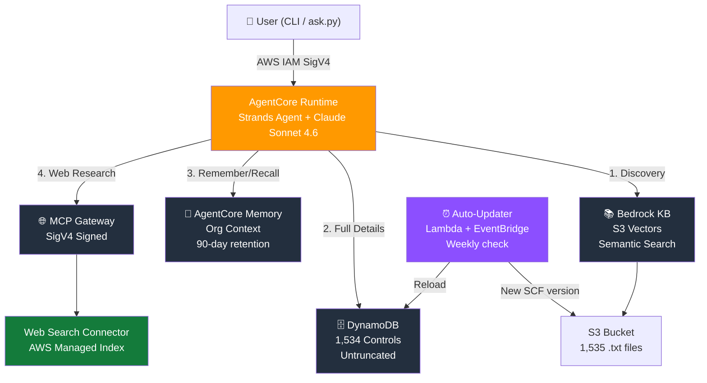

# SCF Compliance Agent - Bedrock AgentCore + Terraform

An agentic compliance workflow powered by Amazon Bedrock AgentCore that provides
AI-driven Secure Controls Framework (SCF) 2026.2 compliance assessment,
gap analysis, and remediation guidance.

## Architecture



## What It Does

1. **Control Lookup** - Query any of 1,534 SCF controls by ID, domain, or keyword
2. **Framework Mapping** - Map between SCF and 252+ regulations (HIPAA, SOX, PCI DSS, NIS2, etc.)
3. **Maturity Assessment** - Assess organizational maturity (SCR-CMM Levels 0-5)
4. **Gap Analysis** - Identify gaps against target frameworks with remediation guidance
5. **Compliance Scoping** - Filter controls by profile (ESP Level 1/2/3, AI, MA&D)
6. **Risk & Threat Correlation** - Link controls to risk scenarios and threats
7. **Web Research** (live internet via Bedrock AgentCore Web Search):
   - Latest regulatory updates and enforcement actions
   - Current CVE/vulnerability intelligence (NVD, CISA KEV)
   - Recent breach cases and outcomes
   - Industry best practices and implementation guides

### Data Source Strategy

| Source | Role | When Used |
|--------|------|-----------|
| Bedrock Knowledge Base (S3 Vectors) | Semantic search to find relevant controls | Discovery — "which controls relate to HIPAA?" |
| DynamoDB | Full untruncated control data (maturity, all mappings, solutions) | Detail — "give me everything about GOV-01" |
| AgentCore Memory | Organization context that persists across sessions | Remembering user's org, controls, targets |
| Bedrock AgentCore Web Search | Live internet for current information | Regulatory updates, CVE intel, breach cases |

**Two-step data flow:** KB search finds the right control IDs fast → DynamoDB returns complete data for those controls. The model then reasons over the full data to produce gap analyses, maturity assessments, and recommendations.

**Long-term memory:** The agent remembers your organization's profile, implemented controls, and compliance targets across sessions. You never have to repeat yourself.

For architecture details, see [docs/architecture-guidelines.md](docs/architecture-guidelines.md).

### Auto-Update Pipeline

The SCF data stays current via a serverless pipeline:

- **EventBridge** triggers a Lambda every Monday at 8:00 UTC
- **Lambda** downloads the latest SCF JSON, compares version against SSM parameter
- If a new version exists: uploads to S3, triggers KB re-ingestion, notifies via SNS
- **SSM Parameter Store** tracks the deployed version
- **S3 versioning** keeps historical copies for rollback

No manual intervention required — your team gets an email when the data updates.

## Prerequisites

- Terraform >= 1.6
- AWS CLI v2 configured with credentials
- Python 3.13+ (for agent code development)
- Access to Amazon Bedrock (Claude model + Titan Embed v2 enabled in your region)
- AgentCore access enabled in your account

## Quick Start

```powershell
# 1. Run preflight check (validates model, credentials, region)
cd scripts
python preflight.py

# 2. Initialize Terraform
cd ..\terraform
cp terraform.tfvars.example terraform.tfvars
# Edit terraform.tfvars with your region, model, and notification email

terraform init
terraform apply

# 3. Build and push the agent container (ARM64 required)
cd ..\agent
# Login to ECR
cmd /c "aws ecr get-login-password --region us-east-1 | docker login --username AWS --password-stdin <account-id>.dkr.ecr.us-east-1.amazonaws.com"
# Build and push (uses pre-downloaded ARM64 wheels for speed)
cmd /c "docker buildx build --platform linux/arm64 -t <ecr-url>:latest --push ."

# 4. Load SCF data into DynamoDB and S3
cd ..\scripts
python load_dynamodb.py
python reindex_kb.py

# 5. Run preflight again to confirm everything works
python preflight.py

# 6. Query the agent
python ask.py --interactive
```

## Querying the Agent

### Interactive Mode (recommended for exploration)

```powershell
cd scripts
python ask.py --interactive
```

This gives you a conversational chat loop. Type `quit` to exit, `clear` to start a new session.

### Single Query

```powershell
python ask.py "Look up SCF control GOV-01 and show me the evidence requirements"
```

### Piped Input

```powershell
echo "What controls map to HIPAA?" | python ask.py
```

### Raw AWS CLI

```powershell
$payload = [Convert]::ToBase64String([Text.Encoding]::UTF8.GetBytes('{"prompt":"your question"}'))
aws bedrock-agentcore invoke-agent-runtime `
  --agent-runtime-arn (terraform output -raw agent_runtime_arn) `
  --payload $payload --region us-east-1 response.json
Get-Content response.json | ConvertFrom-Json | Select-Object -ExpandProperty response
```

### Authentication

The agent is secured by AWS IAM. Anyone invoking it needs AWS credentials with
`bedrock-agentcore:InvokeAgentRuntime` permission on the agent ARN. No API keys,
no OAuth — your existing `aws configure` credentials handle it automatically.

## Sample Queries

### Control Lookup
```
Look up SCF control IAC-15 and show me the full maturity criteria for Levels 2 and 3
```

### Framework Mapping
```
What SCF controls map to EU NIS2 requirements? Show me the top 15 with their NIS2 article references.
```

### Gap Analysis with Compensating Controls
```
We are a medium healthcare SaaS company (175 employees) with these controls implemented:
GOV-01, GOV-02, IAC-01, IAC-06, IAC-15, IAC-21, NET-01, NET-02, CRY-01, CRY-03,
IRO-01, IRO-02, MON-01, MON-02, END-01, VPM-01, SAT-01, HRS-01, TDA-01.

Perform a HIPAA gap analysis. For the top 10 missing controls:
1. Suggest compensating controls we can implement while working toward full compliance
2. List the specific evidence artifacts an auditor would request
3. Recommend the conformity cadence for ongoing monitoring
```

### Evidence Request Checklist
```
For the IAC (Identity & Access Control) domain, generate an evidence request checklist
for a SOC 2 Type II audit. Include the SCF control ID, evidence artifacts needed,
assessment question, and conformity cadence.
```

### Maturity Assessment
```
Assess our Governance (GOV) domain maturity against SCR-CMM Level 3. We have:
- A CISO reporting to CTO with 6 security staff
- Information Security Policy (current)
- Quarterly steering committee (inconsistent attendance)
- No formal metrics program
- Policies managed in SharePoint with manual version control

What specific Level 3 criteria are we missing?
```

### Audit Remediation Plan
```
Our SOC 2 audit found 2 exceptions:
1. IAC-15 (Account Management) - incomplete quarterly access review evidence
2. CRY-05 (Encrypting Data At Rest) - one legacy database not encrypted

For each, provide:
- The full SCR-CMM Level 3 criteria we need to meet
- Compensating controls we can implement within 60 days
- The exact evidence package to present to the auditor
- Related controls the auditor might also examine
```

### Compliance Scoping
```
What controls are required for the SCF ESP Level 1 Foundational profile?
Group them by domain and show the total count.
```

### Cross-Framework Translation
```
We're expanding to the EU in 2027. Map our existing HIPAA controls to EU NIS2
requirements. Which ones transfer directly, and what new controls do we need?
```

### Quantum Readiness
```
What does the new SCF QTS (Quantum Security) domain require? We currently use
TLS 1.2+, AES-256, and RSA 2048. Give us a practical 12-month roadmap for a
medium-sized SaaS company.
```

### Third-Party Risk
```
Generate a vendor security assessment checklist based on SCF TPM domain controls.
Include the assessment questions, evidence to request from vendors, and how to
tier vendors by risk level.
```

## Project Structure

```
scf-compliance-agent/
├── README.md
├── .gitignore
├── terraform/
│   ├── main.tf                 # Core infra (KB, Runtime, Gateway, S3, ECR, IAM)
│   ├── scf-updater.tf         # Auto-update pipeline (Lambda, EventBridge, SNS)
│   ├── variables.tf            # Input variables
│   ├── outputs.tf              # Output values
│   ├── terraform.tfvars.example
│   └── backend.tf.example      # Remote state config template
├── agent/
│   ├── main.py                 # Agent entry point (Strands Agents framework)
│   ├── tools/
│   │   ├── kb_retrieval.py    # Knowledge Base vector search (discovery)
│   │   ├── dynamo_lookup.py   # DynamoDB full control data (detail)
│   │   ├── memory.py          # Long-term organization memory
│   │   └── web_research.py    # Live web search (regulatory, CVE, breaches)
│   ├── wheels/                 # Pre-downloaded ARM64 wheels (fast Docker builds)
│   ├── requirements.txt
│   └── Dockerfile
├── lambda/
│   └── scf_updater/
│       └── handler.py          # Weekly SCF version check + update
├── scripts/
│   ├── ask.py                  # CLI query tool (interactive + single-shot)
│   ├── generate_report.py      # Multi-step report generator
│   ├── preflight.py            # Pre-deployment validation
│   ├── load_dynamodb.py        # Load full SCF data into DynamoDB
│   ├── reindex_kb.py           # Reload trimmed text into KB (S3 Vectors)
│   ├── upload_scf_data.py      # Legacy: initial S3 upload (use load_dynamodb.py instead)
│   └── test_agent.py           # Integration test suite
└── sample-project/             # Fictional company for demos (Acme HealthTech)
    ├── organization-profile.json
    ├── controls-inventory.csv
    ├── infrastructure-summary.md
    ├── policies-and-procedures.md
    ├── recent-incidents.md
    ├── third-party-vendors.md
    └── scan-prompts.md         # 14 ready-to-use demo prompts
```

## Infrastructure Components

| Resource | Type | Purpose |
|----------|------|---------|
| S3 Bucket | `aws_s3_bucket` | Stores SCF text files for KB indexing |
| S3 Vectors Bucket + Index | CLI provisioner | Vector store for KB embeddings |
| Bedrock Knowledge Base | `aws_bedrockagent_knowledge_base` | Semantic search over SCF controls |
| DynamoDB Table | `aws_dynamodb_table` | Full untruncated control data (1,534 items) |
| AgentCore Runtime | `aws_bedrockagentcore_agent_runtime` | Hosts the agent (container, Python 3.13) |
| AgentCore Memory | `aws_bedrockagentcore_memory` | Long-term org context (90-day retention) |
| MCP Gateway | `aws_bedrockagentcore_gateway` | Web Search connector via MCP |
| HTTP Gateway | `aws_bedrockagentcore_gateway` | Routes traffic to the agent runtime |
| ECR Repository | `aws_ecr_repository` | Agent container images (ARM64) |
| Lambda Function | `aws_lambda_function` | Weekly SCF version checker/updater |
| EventBridge Rule | `aws_cloudwatch_event_rule` | Cron trigger (Mondays 8:00 UTC) |
| SNS Topic | `aws_sns_topic` | Update notifications to your team |
| SSM Parameter | `aws_ssm_parameter` | Tracks deployed SCF version |

## Configuration

### Required Variables

| Variable | Description | Default |
|----------|-------------|---------|
| `aws_region` | AWS region (must have Bedrock + AgentCore) | `us-east-1` |
| `project_name` | Prefix for all resource names | `scf-agent` |
| `bedrock_model_id` | FM for agent reasoning | `anthropic.claude-sonnet-4-20250514-v1:0` |
| `embedding_model_id` | Embedding model for KB vectors | `amazon.titan-embed-text-v2:0` |

### Optional Variables

| Variable | Description | Default |
|----------|-------------|---------|
| `log_level` | Agent log level (DEBUG/INFO/WARNING/ERROR) | `INFO` |
| `notification_email` | Email for SCF update alerts | `""` (disabled) |

## Naming Conventions

AgentCore resources have inconsistent naming rules across resource types:

| Resource Type | Allowed Characters | Pattern |
|---------------|-------------------|---------|
| Runtime, Memory | Letters, numbers, underscores | `^[a-zA-Z][a-zA-Z0-9_]{0,47}$` |
| Gateway, Gateway Target | Letters, numbers, hyphens | `^([0-9a-zA-Z][-]?){1,100}$` |
| IAM, S3, ECR, Lambda | Standard AWS naming | Hyphens allowed |

The Terraform handles this automatically using `replace()` where needed.

## Sample Project

The `sample-project/` directory contains a fictional company (**Acme HealthTech** —
175-employee healthcare SaaS) with realistic security posture data and intentional
gaps for the agent to discover. See `sample-project/scan-prompts.md` for 14
ready-to-use prompts that exercise every agent capability.

## Costs

Approximate monthly costs when idle (no active assessments):

| Service | Cost | Notes |
|---------|------|-------|
| S3 (SCF data) | ~$0.01 | <100MB stored |
| Bedrock KB (S3 Vectors) | ~$0.00 | Charged per query, not storage |
| AgentCore Runtime | $0 when idle | Pay-per-session (microVM) |
| AgentCore Memory | ~$0.00 | Charged per operation |
| Lambda (updater) | ~$0.00 | 4 invocations/month |
| Web Search | Per-query | Charged when agent searches |
| Bedrock FM (Claude) | Per-token | Charged per assessment |

Active usage costs depend on assessment volume and conversation length.

## Known Issues

- **Provider bug (aws 6.56):** The `aws_bedrockagentcore_gateway_target` resource for HTTP
  targets may show "Provider produced inconsistent result" on first apply. Run
  `terraform apply -refresh-only` to sync state, then subsequent applies work cleanly.
- **Web Search connector:** Provisioned via CLI (`terraform_data`) since the Terraform
  provider doesn't have native connector target support yet. Manual cleanup needed
  on destroy (see below).

## Cleanup

```powershell
cd terraform
terraform destroy
```

Note: The Web Search gateway target created via CLI will need manual deletion
if `terraform destroy` doesn't catch it:

```powershell
aws bedrock-agentcore-control delete-gateway-target `
  --gateway-identifier <gateway-id> `
  --target-id <target-id> `
  --region us-east-1
```

## About the Secure Controls Framework (SCF)

The [Secure Controls Framework (SCF)](https://securecontrolsframework.com) is a comprehensive
meta-framework maintained by the SCF Council that provides a catalog of security, privacy, and
compliance controls mapped to 252+ laws, regulations, and frameworks worldwide.

### Key SCF Resources

| Resource | URL |
|----------|-----|
| SCF Website | https://securecontrolsframework.com |
| SCF Download (XLSX, JSON) | https://securecontrolsframework.com/free-content/scf-download |
| SCF Overview & Practitioner Guidebook | https://content.securecontrolsframework.com/pdf/scf-recommended-practices.pdf |
| SCF Domain & Principles | Included in the SCF download package |
| SCRMS (GRC Playbook) | Included in the SCF download package |
| SCF Conformity Assessment Program (CAP) | https://securecontrolsframework.com/scf-cap |
| SCF Training (Practitioner, Architect, Assessor) | https://securecontrolsframework.com/training |
| SCFConnect (SaaS GRC Platform) | https://scfconnect.com |

### SCF 2026.2 at a Glance

- **1,534 controls** across **34 domains**
- **252+ mapped frameworks** including NIST 800-53, ISO 27001, HIPAA, PCI DSS, EU NIS2, DORA, AI Act
- **SCR-CMM maturity model** (Levels 0-5) with per-control criteria
- **Risk & Threat correlation** linking controls to specific risk/threat scenarios
- **Size-appropriate guidance** (Micro-Small through Enterprise)
- **Profile-based scoping** (ESP Level 1/2/3, AI Model Deployment, MA&D, SCRMS)
- **New in 2026.2:** Quantum Security (QTS) domain with 34 post-quantum cryptography controls

### SCF Domains (34)

| # | ID | Domain |
|---|-----|--------|
| 1 | GOV | Security, Compliance & Resilience Governance |
| 2 | AAT | Artificial Intelligence & Autonomous Technologies |
| 3 | AST | Asset Management |
| 4 | BCD | Business Continuity & Disaster Recovery |
| 5 | CAP | Capacity & Performance Planning |
| 6 | CHG | Change Management |
| 7 | CLD | Cloud Security |
| 8 | CPL | Compliance |
| 9 | CFG | Configuration Management |
| 10 | MON | Continuous Monitoring |
| 11 | CRY | Cryptographic Protections |
| 12 | DCH | Data Classification & Handling |
| 13 | EMB | Embedded Technology |
| 14 | END | Endpoint Security |
| 15 | HRS | Human Resources Security |
| 16 | IAC | Identity & Access Control |
| 17 | IRO | Incident Response |
| 18 | IAO | Information Assurance |
| 19 | MNT | Maintenance |
| 20 | MDM | Mobile Device Management |
| 21 | NET | Network Security |
| 22 | PES | Physical & Environmental Security |
| 23 | PRI | Privacy |
| 24 | PRM | Project & Resource Management |
| 25 | QTS | Quantum Security |
| 26 | RSK | Risk Management |
| 27 | SEA | Secure Engineering & Architecture |
| 28 | OPS | Security Operations |
| 29 | SAT | Security Awareness & Training |
| 30 | TDA | Technology Development & Acquisition |
| 31 | TPM | Third-Party Management |
| 32 | THR | Threat Management |
| 33 | VPM | Vulnerability & Patch Management |
| 34 | WEB | Web Security |

### License & Attribution

The Secure Controls Framework is free to download and use. SCF content is provided by the
[SCF Council](https://securecontrolsframework.com). This project uses SCF data under the
terms published at the SCF download page. This agent is not affiliated with or endorsed by
the SCF Council — it is an independent implementation that consumes SCF data for compliance
assessment purposes.
