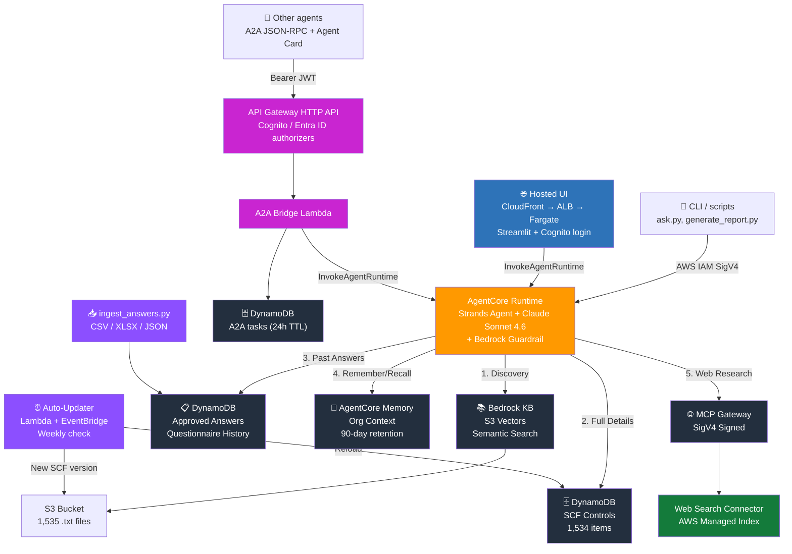

# SCF Compliance Agent - Bedrock AgentCore + Terraform

An agentic compliance workflow powered by Amazon Bedrock AgentCore that provides
AI-driven Secure Controls Framework (SCF) 2026.2 compliance assessment,
gap analysis, and remediation guidance.

## Architecture



**Three ways in, one agent:** the AgentCore Runtime is reachable by (1) AWS principals
via IAM SigV4 (`scripts/ask.py`, `test_agent.py`), (2) the hosted Streamlit UI on
CloudFront → ALB → Fargate with Cognito login, and (3) other agents over the A2A
protocol through an API Gateway HTTP API with Cognito / Entra ID JWT authorizers. The
runtime applies a Bedrock Guardrail (prompt-attack + PII + harmful-security filtering)
on every model call.

## What It Does

1. **Gap Analysis** - Identify missing controls against any target framework
2. **Maturity Assessment** - Score against SCR-CMM Levels 0-5
3. **Framework Mapping** - Map between SCF and 252+ regulations
4. **Evidence Checklists** - Generate audit-ready evidence requirements
5. **Compensating Controls** - Recommend alternatives for gaps
6. **Questionnaire Answers** - Find and reuse historical assessment responses
7. **Web Research** - Live search for regulatory updates, CVEs, breach cases
8. **Long-term Memory** - Remembers your organization across sessions

### Data Source Strategy

| Source | Role | When Used |
|--------|------|-----------|
| DynamoDB (SCF Controls) | Full untruncated control data (1,534 items) | Detail lookups, maturity criteria, all mappings |
| DynamoDB (Approved Answers) | Historical questionnaire responses | Answering security questionnaires, reusing past responses |
| Bedrock Knowledge Base (S3 Vectors) | Semantic search for control discovery | Finding relevant controls by topic |
| AgentCore Memory | Organization context across sessions | Remembering org profile, controls, targets |
| Bedrock AgentCore Web Search | Live internet for current information | Regulatory updates, CVE intel, breach cases |

**Two-step data flow:** KB search finds the right control IDs fast, DynamoDB returns complete data. The model reasons over the full data to produce analyses and recommendations.

**Questionnaire workflow:** User asks "how do we answer X?" Agent searches approved answers first, presents historical responses with source citations. If no match, drafts a new answer from SCF controls.

**Long-term memory:** The agent remembers your organization's profile, implemented controls, and compliance targets across sessions.

For architecture details, see [docs/architecture-guidelines.md](docs/architecture-guidelines.md).

For vector store upgrade options and evaluation guidance, see [docs/vector-store-options.md](docs/vector-store-options.md).

To deploy the security hardening (Bedrock Guardrail wiring, untrusted-content handling, frontend auth, security tests), follow the step-by-step [docs/deploying-security-updates.md](docs/deploying-security-updates.md) runbook.

### Auto-Update Pipeline

The SCF data stays current via a serverless pipeline:

- **EventBridge** triggers a Lambda every Monday at 8:00 UTC
- **Lambda** downloads the latest SCF JSON, compares version against SSM parameter
- If a new version exists: uploads to S3, triggers KB re-ingestion, notifies via SNS
- **SSM Parameter Store** tracks the deployed version
- **S3 versioning** keeps historical copies for rollback

No manual intervention required — your team gets an email when the data updates.

## Prerequisites

- Terraform >= 1.6
- AWS CLI v2 configured with credentials
- Python 3.13+ (for agent code development)
- Access to Amazon Bedrock (Claude model + Titan Embed v2 enabled in your region)
- AgentCore access enabled in your account

## Quick Start

```powershell
# 1. Run preflight check (validates model, credentials, region)
cd scripts
python preflight.py

# 2. Initialize Terraform
cd ..\terraform
cp terraform.tfvars.example terraform.tfvars
# Edit terraform.tfvars with your region, model, and notification email

terraform init
terraform apply

# 3. Build and push the agent container (ARM64 required)
cd ..\agent
# Login to ECR
cmd /c "aws ecr get-login-password --region us-east-1 | docker login --username AWS --password-stdin <account-id>.dkr.ecr.us-east-1.amazonaws.com"
# Build and push (uses pre-downloaded ARM64 wheels for speed)
cmd /c "docker buildx build --platform linux/arm64 -t <ecr-url>:latest --push ."

# 4. Load SCF data into DynamoDB and S3
cd ..\scripts
python load_dynamodb.py
python reindex_kb.py

# 5. (Optional) Load sample questionnaire answers
python ingest_answers.py --file "..\sample-project\sample-questionnaire-financial.csv" --framework "VENDOR_ASSESSMENT" --approved-by "Your Name"

# 6. Run preflight again to confirm everything works
python preflight.py

# 7. Query the agent
python ask.py --interactive
```

## Loading Questionnaire Answers

Import your historical questionnaire responses so the agent can reuse them:

```powershell
# From a CSV file (columns: question, answer, category)
python scripts/ingest_answers.py --file responses.csv --framework SIG --approved-by "Your Name"

# From an Excel file (auto-detects question/answer columns)
python scripts/ingest_answers.py --file soc2_responses.xlsx --framework SOC2

# From a directory of files
python scripts/ingest_answers.py --dir ./questionnaires/ --framework vendor_questionnaire

# Upload a PDF for OCR extraction (auto-triggers Textract pipeline)
aws s3 cp questionnaire.pdf s3://scf-agent-questionnaire-uploads-<ACCOUNT_ID>-us-east-1/ --region us-east-1
```

PDFs and images uploaded to S3 are automatically processed by the Textract OCR pipeline.
Extracted Q&A pairs are stored as `DRAFT` status and must be approved before the agent uses them.

### Approval Workflow

The frontend is **hosted on AWS: ECS Fargate behind an ALB, with CloudFront in front**
for a free HTTPS `*.cloudfront.net` URL that supports the WebSocket Streamlit needs
(`terraform/frontend.tf`). Get the URL with `terraform output -raw frontend_url` and
sign in with a Cognito user (`aws cognito-idp admin-create-user ...`).

- **End users:** see [docs/user-guide.md](docs/user-guide.md) — where to go, how to
  get an account, and how to use the Chat and Approve Answers pages.
- **Deployers:** first-time deploy (image bootstrap + the two-phase `frontend_base_url`
  step) is in
  [docs/frontend-deployment.md](docs/frontend-deployment.md#deployed-ecs-fargate--alb--cloudfront-this-is-what-terraform-apply-provisions).

To run it locally instead — the frontend still requires login before any page
renders; configure authentication once, then run it:

```powershell
cd frontend

# One-time: configure OIDC login (uses Streamlit's built-in auth)
cp .streamlit/secrets.toml.example .streamlit/secrets.toml
# Edit .streamlit/secrets.toml with your OIDC provider details.
# Generate a cookie secret:
#   python -c "import secrets; print(secrets.token_urlsafe(48))"

pip install -r requirements.txt
streamlit run app.py
```

Sign in when prompted, then navigate to **✅ Approve Answers** in the sidebar to:
- View all DRAFT answers extracted from uploaded documents
- Edit answer text before approving
- Approve (sets status, records who/when) or Reject
- See summary metrics (total, approved, draft, rejected)

The agent only surfaces `APPROVED` answers when responding to queries. The
approver recorded in the audit trail is the verified signed-in identity — there
is no free-text name entry.

> **Security note:** Both the chat and approval pages fail closed. If auth isn't
> configured (`.streamlit/secrets.toml` missing), the app refuses to render any
> content. The approval queue is the trust gate for what the agent surfaces, so
> it must never be exposed without login. See
> [docs/frontend-deployment.md](docs/frontend-deployment.md) for provider setup
> and production hardening.

### Audit Trail

Every change to the approved answers database is automatically logged:
- New answers ingested (who imported, when, from what source)
- Answer text modified (before/after values, who changed it)
- Status changes (DRAFT → APPROVED, who approved)
- Answers deleted (full content preserved in log)

Query history for a specific answer:
```powershell
aws dynamodb query --table-name scf-agent-answer-audit-log --index-name answer-history-index --key-condition-expression "answer_id = :id" --expression-attribute-values '{":id":{"S":"<answer-id>"}}' --region us-east-1
```

Audit logs are retained for 365 days.

A sample financial services questionnaire is included at
`sample-project/sample-questionnaire-financial.csv` for testing.

## Querying the Agent

### Interactive Mode (recommended for exploration)

```powershell
cd scripts
python ask.py --interactive
```

This gives you a conversational chat loop. Type `quit` to exit, `clear` to start a new session.

### Single Query

```powershell
python ask.py "Look up SCF control GOV-01 and show me the evidence requirements"
```

### Piped Input

```powershell
echo "What controls map to HIPAA?" | python ask.py
```

### Raw AWS CLI

```powershell
$payload = [Convert]::ToBase64String([Text.Encoding]::UTF8.GetBytes('{"prompt":"your question"}'))
aws bedrock-agentcore invoke-agent-runtime `
  --agent-runtime-arn (terraform output -raw agent_runtime_arn) `
  --payload $payload --region us-east-1 response.json
Get-Content response.json | ConvertFrom-Json | Select-Object -ExpandProperty response
```

### Authentication

Three independent paths, three auth models:

| Path | Auth |
|------|------|
| Direct `InvokeAgentRuntime` (CLI, `scripts/`, IAM principals) | AWS IAM / SigV4 — needs `bedrock-agentcore:InvokeAgentRuntime` on the agent ARN; your `aws configure` credentials handle it automatically |
| Hosted Streamlit UI | Cognito OIDC login (`st.login`); the app fails closed with no login configured |
| A2A ingress (other agents) | OAuth2 / OIDC **bearer JWT** validated at API Gateway — Amazon Cognito or Microsoft Entra ID (see below) |

### Agent-to-Agent (A2A) access

For callers that are *other agents* rather than AWS principals, an API Gateway HTTP API
accepts incoming [A2A protocol](https://a2a-protocol.org) connections (JSON-RPC 2.0 +
Agent Card discovery) and forwards them to the same AgentCore Runtime. Two routes, each
with its own JWT authorizer:

| Route | Authorizer |
|-------|-----------|
| `POST /cognito/rpc` | Amazon Cognito (M2M client_credentials **and** hosted-UI users) |
| `POST /entra/rpc` | Microsoft Entra ID (optional — set `entra_tenant_id`) |

```powershell
cd terraform
terraform apply
terraform output a2a_cognito_agent_card_url   # discover
terraform output a2a_cognito_rpc_url           # call
```

Full setup, token recipes, Entra app-registration steps, and sample calls are in
[docs/a2a-integration.md](docs/a2a-integration.md).

## Sample Queries

### Control Lookup
```
Look up SCF control IAC-15 and show me the full maturity criteria for Levels 2 and 3
```

### Framework Mapping
```
What SCF controls map to EU NIS2 requirements? Show me the top 15 with their NIS2 article references.
```

### Gap Analysis with Compensating Controls
```
We are a medium healthcare SaaS company (175 employees) with these controls implemented:
GOV-01, GOV-02, IAC-01, IAC-06, IAC-15, IAC-21, NET-01, NET-02, CRY-01, CRY-03,
IRO-01, IRO-02, MON-01, MON-02, END-01, VPM-01, SAT-01, HRS-01, TDA-01.

Perform a HIPAA gap analysis. For the top 10 missing controls:
1. Suggest compensating controls we can implement while working toward full compliance
2. List the specific evidence artifacts an auditor would request
3. Recommend the conformity cadence for ongoing monitoring
```

### Evidence Request Checklist
```
For the IAC (Identity & Access Control) domain, generate an evidence request checklist
for a SOC 2 Type II audit. Include the SCF control ID, evidence artifacts needed,
assessment question, and conformity cadence.
```

### Maturity Assessment
```
Assess our Governance (GOV) domain maturity against SCR-CMM Level 3. We have:
- A CISO reporting to CTO with 6 security staff
- Information Security Policy (current)
- Quarterly steering committee (inconsistent attendance)
- No formal metrics program
- Policies managed in SharePoint with manual version control

What specific Level 3 criteria are we missing?
```

### Audit Remediation Plan
```
Our SOC 2 audit found 2 exceptions:
1. IAC-15 (Account Management) - incomplete quarterly access review evidence
2. CRY-05 (Encrypting Data At Rest) - one legacy database not encrypted

For each, provide:
- The full SCR-CMM Level 3 criteria we need to meet
- Compensating controls we can implement within 60 days
- The exact evidence package to present to the auditor
- Related controls the auditor might also examine
```

### Compliance Scoping
```
What controls are required for the SCF ESP Level 1 Foundational profile?
Group them by domain and show the total count.
```

### Cross-Framework Translation
```
We're expanding to the EU in 2027. Map our existing HIPAA controls to EU NIS2
requirements. Which ones transfer directly, and what new controls do we need?
```

### Quantum Readiness
```
What does the new SCF QTS (Quantum Security) domain require? We currently use
TLS 1.2+, AES-256, and RSA 2048. Give us a practical 12-month roadmap for a
medium-sized SaaS company.
```

### Third-Party Risk
```
Generate a vendor security assessment checklist based on SCF TPM domain controls.
Include the assessment questions, evidence to request from vendors, and how to
tier vendors by risk level.
```

### Questionnaire Answers
```
How do we answer the SIG question about data encryption at rest?
```

```
What did we put for incident response in our last SOC 2 assessment?
```

```
I need to fill out a vendor security questionnaire. The question is:
"Describe your access control and authentication mechanisms."
What's our standard response?
```

## Project Structure

```
scf-compliance-agent/
├── README.md
├── .gitignore
├── terraform/
│   ├── main.tf                 # Core infra (KB, Runtime, Gateway, S3, ECR, IAM)
│   ├── guardrails.tf           # Bedrock Guardrail + immutable version
│   ├── scf-updater.tf         # Auto-update pipeline (Lambda, EventBridge, SNS)
│   ├── a2a.tf                  # A2A ingress (API Gateway, JWT authorizers, bridge Lambda)
│   ├── cognito-a2a.tf          # Cognito user pool + M2M / hosted-UI clients for A2A
│   ├── frontend.tf             # Hosted Streamlit: ECS Fargate + ALB + CloudFront + Cognito client
│   ├── deploy-operator-policy.tf # Managed IAM policy for whoever runs the deploy scripts
│   ├── variables.tf            # Input variables
│   ├── outputs.tf              # Output values
│   ├── terraform.tfvars.example
│   └── backend.tf.example      # Remote state config template
├── agent/
│   ├── main.py                 # Agent entry point (Strands Agents framework)
│   ├── tools/
│   │   ├── kb_retrieval.py    # Knowledge Base vector search (discovery)
│   │   ├── dynamo_lookup.py   # DynamoDB full control data (detail)
│   │   ├── answers_lookup.py  # Historical questionnaire answers
│   │   ├── memory.py          # Long-term organization memory
│   │   └── web_research.py    # Live web search (regulatory, CVE, breaches)
│   ├── wheels/                 # Pre-downloaded ARM64 wheels (fast Docker builds)
│   ├── requirements.txt
│   ├── Dockerfile
│   ├── build-and-push.ps1      # Build + push the ARM64 agent image (-UpdateRuntime to roll)
│   └── update-runtime.ps1      # Roll the runtime onto a freshly pushed :latest image
├── lambda/
│   ├── scf_updater/
│   │   └── handler.py          # Weekly SCF version check + update
│   ├── audit_logger/
│   │   └── handler.py          # DynamoDB Stream → answer audit log
│   ├── textract_pipeline/
│   │   └── handler.py          # OCR extraction from uploaded documents
│   └── a2a_bridge/
│       ├── handler.py          # A2A JSON-RPC ↔ AgentCore Runtime bridge
│       └── agent_card.py       # Builds the per-route A2A Agent Card
├── scripts/
│   ├── ask.py                  # CLI query tool (interactive + single-shot)
│   ├── generate_report.py      # Multi-step report generator
│   ├── preflight.py            # Pre-deployment validation
│   ├── eval_retrieval.py       # Automated retrieval accuracy evaluation
│   ├── ingest_answers.py       # Import questionnaire answers (CSV/XLSX/JSON)
│   ├── load_dynamodb.py        # Load full SCF data into DynamoDB
│   ├── reindex_kb.py           # Reload trimmed text into KB (S3 Vectors)
│   ├── upload_scf_data.py      # Legacy: initial S3 upload (use load_dynamodb.py instead)
│   └── test_agent.py           # Integration test suite
├── frontend/
│   ├── app.py                  # Chat interface (Streamlit, boto3 InvokeAgentRuntime)
│   ├── auth.py                 # Fail-closed OIDC login gate (st.login / st.user)
│   ├── pages/
│   │   └── 2_Approve_Answers.py # Answer approval queue (approver = signed-in identity)
│   ├── .streamlit/
│   │   ├── config.toml
│   │   └── secrets.toml.example
│   ├── Dockerfile              # python:3.13-slim; entrypoint writes secrets.toml from env
│   ├── entrypoint.sh
│   ├── build-and-push.ps1      # Build + push the frontend image (linux/amd64)
│   └── requirements.txt
├── docs/
│   ├── user-guide.md               # For people using the web app (URL, login, pages)
│   ├── architecture-guidelines.md
│   ├── deployment-decisions.md
│   ├── a2a-integration.md          # A2A auth setup, token recipes, sample calls
│   ├── a2a-streaming.md            # Options + trade-offs for true streaming / lifting the 30s cap
│   ├── frontend-deployment.md      # Fargate + ALB + CloudFront runbook
│   ├── deploying-security-updates.md # Guardrail + prompt hardening + frontend auth runbook
│   ├── troubleshooting.md
│   └── vector-store-options.md
└── sample-project/             # Fictional company for demos (Acme HealthTech)
    ├── organization-profile.json
    ├── controls-inventory.csv
    ├── infrastructure-summary.md
    ├── policies-and-procedures.md
    ├── recent-incidents.md
    ├── third-party-vendors.md
    └── scan-prompts.md         # 14 ready-to-use demo prompts
```

## Infrastructure Components

| Resource | Type | Purpose |
|----------|------|---------|
| S3 Bucket (SCF data) | `aws_s3_bucket` | Stores SCF text files for KB indexing |
| S3 Bucket (Questionnaires) | `aws_s3_bucket` | Upload bucket for questionnaire documents (future OCR) |
| S3 Vectors Bucket + Index | CLI provisioner | Vector store for KB embeddings |
| Bedrock Knowledge Base | `aws_bedrockagent_knowledge_base` | Semantic search over SCF controls |
| DynamoDB (SCF Controls) | `aws_dynamodb_table` | Full untruncated control data (1,534 items) |
| DynamoDB (Approved Answers) | `aws_dynamodb_table` | Historical questionnaire responses |
| DynamoDB (Audit Log) | `aws_dynamodb_table` | Change history for all answer modifications |
| AgentCore Runtime | `aws_bedrockagentcore_agent_runtime` | Hosts the agent (container, Python 3.13) |
| AgentCore Memory | `aws_bedrockagentcore_memory` | Long-term org context (90-day retention) |
| MCP Gateway | `aws_bedrockagentcore_gateway` | Web Search connector via MCP |
| HTTP Gateway | `aws_bedrockagentcore_gateway` | Routes traffic to the agent runtime |
| A2A HTTP API | `aws_apigatewayv2_api` | Incoming A2A (Agent-to-Agent) connections |
| A2A JWT Authorizers | `aws_apigatewayv2_authorizer` | Cognito + Entra ID token validation |
| A2A Bridge Lambda | `aws_lambda_function` | Translates A2A JSON-RPC → `InvokeAgentRuntime` |
| A2A Task Store | `aws_dynamodb_table` | Completed A2A tasks, 24h TTL (`tasks/get`) |
| Cognito User Pool | `aws_cognito_user_pool` | Shared identity provider for the A2A Cognito route + the hosted UI |
| ECR Repository (agent) | `aws_ecr_repository` | Agent container images (ARM64) |
| ECR Repository (frontend) | `aws_ecr_repository` | Streamlit frontend images (x86_64) |
| Frontend Service | `aws_ecs_service` (Fargate) | Runs the Streamlit container |
| Frontend Load Balancer | `aws_lb` | ALB; only accepts the CloudFront edge prefix list |
| Frontend CDN | `aws_cloudfront_distribution` | Free HTTPS `*.cloudfront.net` + WebSocket for Streamlit |
| Frontend Cognito Client | `aws_cognito_user_pool_client` | Confidential OIDC client for `st.login` |
| Frontend Auth Secrets | `aws_ssm_parameter` (SecureString) | Cognito client secret + Streamlit cookie secret |
| Deploy Operator Policy | `aws_iam_policy` | Least-privilege policy for whoever runs `build-and-push.ps1` / `update-runtime.ps1` (not attached) |
| Bedrock Guardrail | `aws_bedrock_guardrail` + `_version` | Prompt-attack + PII + harmful-security filtering on every model call |
| Audit Logger Lambda | `aws_lambda_function` | Captures all answer changes to audit log |
| Textract Pipeline Lambda | `aws_lambda_function` | OCR extraction from uploaded documents |
| Lambda Function | `aws_lambda_function` | Weekly SCF version checker/updater |
| EventBridge Rule | `aws_cloudwatch_event_rule` | Cron trigger (Mondays 8:00 UTC) |
| SNS Topic | `aws_sns_topic` | Update notifications to your team |
| SSM Parameter | `aws_ssm_parameter` | Tracks deployed SCF version |

## Configuration

### Required Variables

| Variable | Description | Default |
|----------|-------------|---------|
| `aws_region` | AWS region (must have Bedrock + AgentCore) | `us-east-1` |
| `project_name` | Prefix for all resource names | `scf-agent` |
| `bedrock_model_id` | FM for agent reasoning | `anthropic.claude-sonnet-4-20250514-v1:0` |
| `embedding_model_id` | Embedding model for KB vectors | `amazon.titan-embed-text-v2:0` |

### Optional Variables

| Variable | Description | Default |
|----------|-------------|---------|
| `log_level` | Agent log level (DEBUG/INFO/WARNING/ERROR) | `INFO` |
| `notification_email` | Email for SCF update alerts | `""` (disabled) |
| `enable_a2a` | Provision the A2A API Gateway + bridge Lambda | `true` |
| `agent_public_name` | Name published in the A2A Agent Card | `SCF Compliance Assessment Agent` |
| `cognito_a2a_domain_prefix` | Globally-unique Cognito hosted-UI domain prefix | `scf-agent-a2a` |
| `cognito_a2a_web_callback_urls` | Allowed callback/logout URLs for the hosted-UI Cognito client | `["http://localhost:8501/oauth2callback", "http://localhost:8501/"]` |
| `entra_tenant_id` | Microsoft Entra tenant ID; empty = skip the `/entra/*` route | `""` |
| `entra_audience` | Expected `aud` for Entra tokens (App ID URI or client ID) | `""` |
| `entra_issuer_override` | Force a non-default Entra issuer (e.g. v1.0 `sts.windows.net`) | `""` |
| `a2a_custom_domain` | Vanity host for the A2A Agent Card URLs (DNS/cert managed elsewhere) | `""` |
| `enable_frontend` | Host the Streamlit UI on Fargate + ALB + CloudFront (needs `enable_a2a`) | `true` |
| `frontend_base_url` | Public HTTPS base URL of the frontend; set to the `frontend_url` output on the 2nd apply | `""` |

## Naming Conventions

AgentCore resources have inconsistent naming rules across resource types:

| Resource Type | Allowed Characters | Pattern |
|---------------|-------------------|---------|
| Runtime, Memory | Letters, numbers, underscores | `^[a-zA-Z][a-zA-Z0-9_]{0,47}$` |
| Gateway, Gateway Target | Letters, numbers, hyphens | `^([0-9a-zA-Z][-]?){1,100}$` |
| IAM, S3, ECR, Lambda | Standard AWS naming | Hyphens allowed |

The Terraform handles this automatically using `replace()` where needed.

## Sample Project

The `sample-project/` directory contains a fictional company (**Acme HealthTech** —
175-employee healthcare SaaS) with realistic security posture data and intentional
gaps for the agent to discover. See `sample-project/scan-prompts.md` for 14
ready-to-use prompts that exercise every agent capability.

## Costs

Approximate monthly costs when idle (no active assessments):

| Service | Cost | Notes |
|---------|------|-------|
| S3 (SCF data) | ~$0.01 | <100MB stored |
| Bedrock KB (S3 Vectors) | ~$0.00 | Charged per query, not storage |
| AgentCore Runtime | $0 when idle | Pay-per-session (microVM) |
| AgentCore Memory | ~$0.00 | Charged per operation |
| Lambda (updater) | ~$0.00 | 4 invocations/month |
| Web Search | Per-query | Charged when agent searches |
| Bedrock FM (Claude) | Per-token | Charged per assessment |

Active usage costs depend on assessment volume and conversation length.

## Known Issues

- **Provider bug (aws 6.56):** The `aws_bedrockagentcore_gateway_target` resource for HTTP
  targets may show "Provider produced inconsistent result" on first apply. Run
  `terraform apply -refresh-only` to sync state, then subsequent applies work cleanly.
- **Web Search connector:** Provisioned via CLI (`terraform_data`) since the Terraform
  provider doesn't have native connector target support yet. Manual cleanup needed
  on destroy (see below).

## Cleanup

```powershell
cd terraform
terraform destroy
```

Note: The Web Search gateway target created via CLI will need manual deletion
if `terraform destroy` doesn't catch it:

```powershell
aws bedrock-agentcore-control delete-gateway-target `
  --gateway-identifier <gateway-id> `
  --target-id <target-id> `
  --region us-east-1
```

## About the Secure Controls Framework (SCF)

The [Secure Controls Framework (SCF)](https://securecontrolsframework.com) is a comprehensive
meta-framework maintained by the SCF Council that provides a catalog of security, privacy, and
compliance controls mapped to 252+ laws, regulations, and frameworks worldwide.

### Key SCF Resources

| Resource | URL |
|----------|-----|
| SCF Website | https://securecontrolsframework.com |
| SCF Download (XLSX, JSON) | https://securecontrolsframework.com/free-content/scf-download |
| SCF Overview & Practitioner Guidebook | https://content.securecontrolsframework.com/pdf/scf-recommended-practices.pdf |
| SCF Domain & Principles | Included in the SCF download package |
| SCRMS (GRC Playbook) | Included in the SCF download package |
| SCF Conformity Assessment Program (CAP) | https://securecontrolsframework.com/scf-cap |
| SCF Training (Practitioner, Architect, Assessor) | https://securecontrolsframework.com/training |
| SCFConnect (SaaS GRC Platform) | https://scfconnect.com |

### SCF 2026.2 at a Glance

- **1,534 controls** across **34 domains**
- **252+ mapped frameworks** including NIST 800-53, ISO 27001, HIPAA, PCI DSS, EU NIS2, DORA, AI Act
- **SCR-CMM maturity model** (Levels 0-5) with per-control criteria
- **Risk & Threat correlation** linking controls to specific risk/threat scenarios
- **Size-appropriate guidance** (Micro-Small through Enterprise)
- **Profile-based scoping** (ESP Level 1/2/3, AI Model Deployment, MA&D, SCRMS)
- **New in 2026.2:** Quantum Security (QTS) domain with 34 post-quantum cryptography controls

### SCF Domains (34)

| # | ID | Domain |
|---|-----|--------|
| 1 | GOV | Security, Compliance & Resilience Governance |
| 2 | AAT | Artificial Intelligence & Autonomous Technologies |
| 3 | AST | Asset Management |
| 4 | BCD | Business Continuity & Disaster Recovery |
| 5 | CAP | Capacity & Performance Planning |
| 6 | CHG | Change Management |
| 7 | CLD | Cloud Security |
| 8 | CPL | Compliance |
| 9 | CFG | Configuration Management |
| 10 | MON | Continuous Monitoring |
| 11 | CRY | Cryptographic Protections |
| 12 | DCH | Data Classification & Handling |
| 13 | EMB | Embedded Technology |
| 14 | END | Endpoint Security |
| 15 | HRS | Human Resources Security |
| 16 | IAC | Identity & Access Control |
| 17 | IRO | Incident Response |
| 18 | IAO | Information Assurance |
| 19 | MNT | Maintenance |
| 20 | MDM | Mobile Device Management |
| 21 | NET | Network Security |
| 22 | PES | Physical & Environmental Security |
| 23 | PRI | Privacy |
| 24 | PRM | Project & Resource Management |
| 25 | QTS | Quantum Security |
| 26 | RSK | Risk Management |
| 27 | SEA | Secure Engineering & Architecture |
| 28 | OPS | Security Operations |
| 29 | SAT | Security Awareness & Training |
| 30 | TDA | Technology Development & Acquisition |
| 31 | TPM | Third-Party Management |
| 32 | THR | Threat Management |
| 33 | VPM | Vulnerability & Patch Management |
| 34 | WEB | Web Security |

### License & Attribution

The Secure Controls Framework is free to download and use. SCF content is provided by the
[SCF Council](https://securecontrolsframework.com). This project uses SCF data under the
terms published at the SCF download page. This agent is not affiliated with or endorsed by
the SCF Council — it is an independent implementation that consumes SCF data for compliance
assessment purposes.
