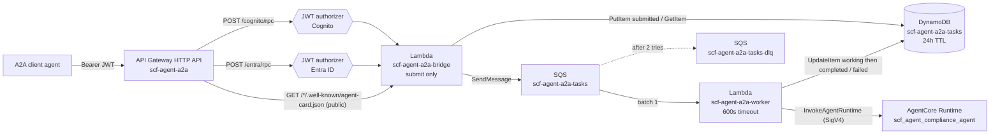
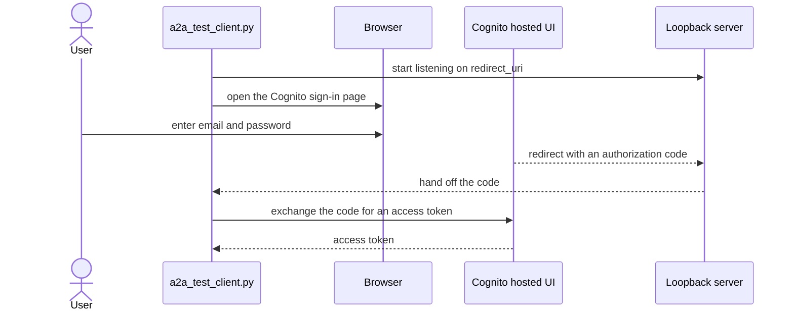
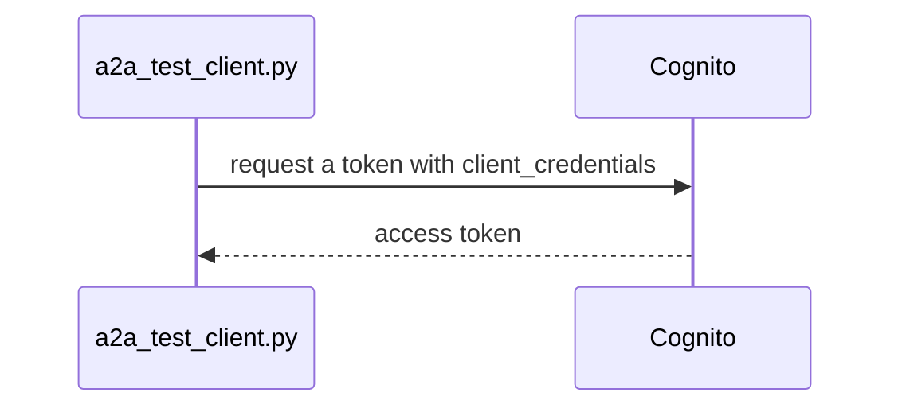
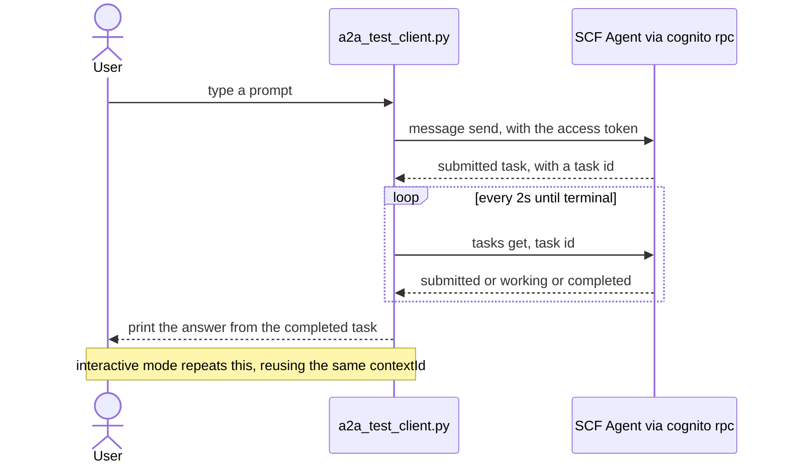

# A2A (Agent-to-Agent) Integration

The SCF Compliance Agent accepts **incoming [A2A protocol](https://a2a-protocol.org)
connections** so other agents can discover it (via an Agent Card) and call it over
JSON-RPC 2.0.

Two independent identity providers are supported, one per route:

| Route | Authorizer | Typical caller |
|-------|-----------|----------------|
| `POST /cognito/rpc` | Amazon Cognito (JWT) | Agents/services (client_credentials) **or** humans (hosted-UI login) |
| `POST /entra/rpc` | Microsoft Entra ID (JWT) | Agents/services in a Microsoft 365 / Azure tenant |

Both routes reach the **same** agent. The split is purely about *who is allowed to call*.

## Architecture



The existing IAM/SigV4 path (`scripts/ask.py`, the AgentCore MCP/HTTP gateways) is
unchanged — this is additive ingress.

### What the bridge does

1. **Agent Card discovery** — `GET /{cognito|entra}/.well-known/agent-card.json` returns a
   spec-compliant AgentCard describing the agent, its skills, and the security scheme for
   that route. Public (no token) so clients can learn how to authenticate. A generic card
   listing both schemes is at `GET /.well-known/agent-card.json`.
2. **`message/send`** (non-blocking) — extracts text from `params.message.parts`, writes a
   `Task {state: "submitted"}` to DynamoDB (24 h TTL), enqueues it on SQS, and returns that
   `submitted` Task in under a second. It does **not** wait for the agent. A separate worker
   Lambda (`lambda/a2a_worker`, SQS-triggered, 600 s timeout) picks the task up, sets it
   `working`, calls `bedrock-agentcore:InvokeAgentRuntime`, and updates the Task to
   `completed` (answer as a `text` artifact) or `failed`. The `configuration.blocking` flag
   is ignored — honoring it would re-introduce the 30 s API Gateway timeout.
3. **`tasks/get`** — reads the Task from DynamoDB. **This is how a client gets the answer:**
   poll it until `status.state` is terminal (`completed` / `failed` / `canceled`).
4. **`tasks/cancel`** — marks a non-terminal Task `canceled` (conditional write). A worker
   that finishes right after a cancel does not overwrite it. Terminal task → `-32002`.
5. **`message/stream`**, **`tasks/resubscribe`** — **not supported**. The Agent Card
   advertises `capabilities.streaming = false`; these return `-32004`. Use `message/send`,
   then poll `tasks/get`. The async model removes the timeout but does not deliver
   incremental frames — see [Streaming notes](#streaming-notes) and
   [docs/a2a-streaming.md](a2a-streaming.md).
6. **`tasks/pushNotificationConfig/*`** — `-32003` PushNotificationNotSupported.

Caller isolation: the AgentCore `runtimeSessionId` is `sha256(f"{caller}:{contextId}")`, so
two callers that pass the same `contextId` do not share one AgentCore session.

## Deploy

```powershell
cd terraform
# terraform.tfvars: set at least these for A2A
#   enable_a2a                = true
#   cognito_a2a_domain_prefix = "your-unique-prefix"      # globally unique
#   entra_tenant_id           = ""                        # optional; see below
terraform apply
terraform output        # collect the a2a_* and cognito_a2a_* values
```

`cognito_a2a_domain_prefix` must be a **globally unique** Cognito domain prefix. If
`terraform apply` fails on the domain, pick another prefix.

Neither Lambda has a **build step** — Terraform zips `lambda/a2a_bridge/` and
`lambda/a2a_worker/` directly (stdlib + the Lambda-provided `boto3` only). The async task
model (SQS work queue + DLQ + worker) in `terraform/a2a-async.tf` is created automatically
whenever `enable_a2a = true`; tune it with `a2a_worker_timeout` (default 600 s) and
`a2a_worker_max_concurrency` (default 5, min 2 — the SQS event-source concurrency cap).

If `entra_tenant_id` is empty, the `/entra/*` routes and authorizer are simply not created;
everything else still works.

## Calling the agent — Cognito (machine-to-machine)

```bash
CID=$(terraform output -raw cognito_a2a_m2m_client_id)
SECRET=$(terraform output -raw cognito_a2a_m2m_client_secret)
TOKEN_URL=$(terraform output -raw cognito_a2a_token_endpoint)
SCOPE=$(terraform output -raw cognito_a2a_scope)
RPC=$(terraform output -raw a2a_cognito_rpc_url)

# 1. Get an access token (client_credentials)
TOKEN=$(curl -s -u "$CID:$SECRET" \
  -d "grant_type=client_credentials&scope=$SCOPE" \
  "$TOKEN_URL" | python -c "import sys,json;print(json.load(sys.stdin)['access_token'])")

# 2. Discover
curl -s "$(terraform output -raw a2a_cognito_agent_card_url)" | python -m json.tool

# 3. message/send — returns immediately with a "submitted" Task; grab result.id
TASK_ID=$(curl -s -X POST "$RPC" \
  -H "Authorization: Bearer $TOKEN" \
  -H "content-type: application/json" \
  -d '{
    "jsonrpc": "2.0",
    "id": "1",
    "method": "message/send",
    "params": {
      "message": {
        "role": "user",
        "messageId": "m1",
        "parts": [{ "kind": "text", "text": "Look up SCF control GOV-01 and list the evidence requirements" }]
      }
    }
  }' | python -c "import sys,json;print(json.load(sys.stdin)['result']['id'])")

# 4. Poll tasks/get until the state is terminal — this is how you get the answer
while :; do
  RESP=$(curl -s -X POST "$RPC" -H "Authorization: Bearer $TOKEN" -H "content-type: application/json" \
    -d "{\"jsonrpc\":\"2.0\",\"id\":\"2\",\"method\":\"tasks/get\",\"params\":{\"id\":\"$TASK_ID\"}}")
  STATE=$(echo "$RESP" | python -c "import sys,json;print(json.load(sys.stdin)['result']['status']['state'])")
  echo "state=$STATE"
  case "$STATE" in completed|failed|canceled|rejected) break;; esac
  sleep 2
done
echo "$RESP" | python -m json.tool   # result.artifacts[0].parts[0].text holds the answer
```

### Cognito — interactive users (hosted UI)

The `cognito_a2a_web_client_id` app client uses the `authorization_code` flow (PKCE, no
client secret — it's a public client). Users sign in at:

```
https://<cognito_a2a_domain_prefix>.auth.<region>.amazoncognito.com/login
  ?client_id=<cognito_a2a_web_client_id>
  &response_type=code
  &scope=openid+email+<cognito_a2a_scope>
  &redirect_uri=<one of cognito_a2a_web_callback_urls>
```

Create users with `aws cognito-idp admin-create-user` / `admin-set-user-password` (the pool
is admin-create-only — see [docs/user-guide.md](user-guide.md)). Exchange the returned `code`
at the same `/oauth2/token` endpoint for an access token, then call `/cognito/rpc` exactly
as above.

**Easiest way to actually run this:** `python scripts/a2a_test_client.py --auth login "<prompt>"`
drives the whole flow for you — opens your browser to the Cognito hosted UI, catches the
PKCE redirect with a local loopback server (no copy-pasting a `code` out of the address bar),
exchanges it, and sends a real `message/send`. `--auth m2m` does the same with
client_credentials (no browser). `--card-only` just fetches the Agent Card. `--interactive`
gives you a chat loop reusing the same `contextId`. Needs at least one confirmed user in the
pool and `redirect_uri` (default `http://localhost:8501/oauth2callback`) registered in
`cognito_a2a_web_callback_urls`.

**1. Login (`--auth login`) — hosted-UI sign-in:**



**2. Machine-to-machine (`--auth m2m`) — no browser:**



**3. Calling the agent — same for both auth modes:**



## Calling the agent — Microsoft Entra ID

### One-time: register the API in your tenant

1. **Entra admin center → App registrations → New registration** — name it e.g.
   `SCF Compliance Agent (A2A API)`. Single tenant is fine.
2. **Expose an API → Set** the *Application ID URI*, e.g.
   `api://scf-compliance-agent`. This value is your **`entra_audience`**.
3. **Expose an API → Add a scope** — e.g. `Agent.Invoke` (admin consent). Client apps that
   use delegated/OBO flows request `api://scf-compliance-agent/Agent.Invoke`.
   For pure app-to-app, add an **App role** instead (e.g. `Agent.Invoke`, member type
   *Applications*) — callers then use `.default`.
4. The **caller** (the other agent) registers its own app, is granted the scope/role above,
   and gets tokens via `client_credentials`:

   ```bash
   curl -s -X POST "https://login.microsoftonline.com/<tenant-id>/oauth2/v2.0/token" \
     -d "grant_type=client_credentials" \
     -d "client_id=<caller-app-id>" \
     -d "client_secret=<caller-secret>" \
     -d "scope=api://scf-compliance-agent/.default"
   ```

### Terraform values

```hcl
entra_tenant_id = "00000000-0000-0000-0000-000000000000"   # your directory (tenant) ID
entra_audience  = "api://scf-compliance-agent"              # the App ID URI from step 2
# entra_issuer_override = "https://sts.windows.net/<tenant-id>/"   # ONLY if callers send v1.0 tokens
```

The default issuer is the v2.0 endpoint
`https://login.microsoftonline.com/<tenant-id>/v2.0`. If a caller's tokens have
`"ver": "1.0"`, set `entra_issuer_override` to the `sts.windows.net` form and make sure
`entra_audience` matches the v1.0 `aud` (often the client ID GUID rather than the URI).

### Call it

Identical to the Cognito example (submit, then poll `tasks/get`), but hit
`a2a_entra_rpc_url` with the Entra token:

```bash
RPC=$(terraform output -raw a2a_entra_rpc_url)
TASK_ID=$(curl -s -X POST "$RPC" -H "Authorization: Bearer $ENTRA_TOKEN" -H "content-type: application/json" \
  -d '{"jsonrpc":"2.0","id":"1","method":"message/send","params":{"message":{"role":"user","messageId":"m1","parts":[{"kind":"text","text":"What SCF controls map to HIPAA?"}]}}}' \
  | python -c "import sys,json;print(json.load(sys.stdin)['result']['id'])")
curl -s -X POST "$RPC" -H "Authorization: Bearer $ENTRA_TOKEN" -H "content-type: application/json" \
  -d "{\"jsonrpc\":\"2.0\",\"id\":\"2\",\"method\":\"tasks/get\",\"params\":{\"id\":\"$TASK_ID\"}}"   # repeat until state is terminal
```

## Using an A2A SDK client

Any A2A-compliant client works — point it at the card URL and supply a bearer token.

```python
# pip install a2a-sdk httpx
import asyncio, httpx
from a2a.client import A2ACardResolver, A2AClient
from a2a.types import Message, TextPart, MessageSendParams, SendMessageRequest

CARD_URL = "https://<api-id>.execute-api.us-east-1.amazonaws.com/cognito/.well-known/agent-card.json"
TOKEN = "..."  # Cognito or Entra access token

async def main():
    async with httpx.AsyncClient(headers={"Authorization": f"Bearer {TOKEN}"}) as http:
        card = await A2ACardResolver(http, CARD_URL).get_agent_card()
        client = A2AClient(http, agent_card=card)
        req = SendMessageRequest(params=MessageSendParams(
            message=Message(role="user", messageId="m1",
                            parts=[TextPart(text="Assess our GOV domain maturity against SCR-CMM Level 3")])))
        # message/send is non-blocking: this Task comes back "submitted".
        task = (await client.send_message(req)).root.result
        # Poll tasks/get until terminal. (a2a-sdk: client.get_task(TaskQueryParams(id=task.id)))
        # The answer is on the completed task's artifacts[0].parts[0].text.
        print(task.model_dump(exclude_none=True))

asyncio.run(main())
```

## Streaming notes

This bridge **does not stream**. The Agent Card advertises
`capabilities.streaming = false`, and `message/stream` / `tasks/resubscribe` return a
JSON-RPC `-32004` error. Two AWS limits make real streaming impossible on this transport:
API Gateway HTTP APIs buffer a Lambda-proxy response and cap it at **30 s**, and the Python
*managed* Lambda runtime can't stream a response body at all.

The **async task model** works around the 30 s cap for *getting an answer*: `message/send`
returns a `submitted` Task in under a second, an SQS-triggered worker Lambda (600 s timeout)
runs the agent out of band, and the client polls `tasks/get`. A long query (full gap
analysis, multi-step report) no longer fails at 30 s — but the caller still receives the
whole answer at once when the task reaches `completed`, not incrementally.

To add real incremental (SSE) delivery or token-level streaming, see
**[docs/a2a-streaming.md](a2a-streaming.md)** — it marks the async model as implemented and
lays out the Lambda Function URL + Lambda Web Adapter and Fargate options with their
trade-offs, plus what token-level streaming additionally requires from the agent container.

## Supported / unsupported methods

| Method | Status |
|--------|--------|
| `message/send` | ✅ non-blocking — returns a `submitted` `Task`; the worker runs the turn |
| `tasks/get` | ✅ from the 24 h task store — **poll this until terminal to get the answer** |
| `tasks/cancel` | ✅ marks a non-terminal `Task` `canceled`; terminal task → `-32002` |
| `message/stream` | ⛔ `-32004` — `capabilities.streaming = false`; use `message/send` + `tasks/get` |
| `tasks/resubscribe` | ⛔ `-32004` — no stream to resubscribe to |
| `tasks/pushNotificationConfig/*` | ⛔ `-32003` PushNotificationNotSupported |
| unknown | ⛔ `-32601` MethodNotFound |

## Troubleshooting

| Symptom | Cause / fix |
|---------|-------------|
| `401 Unauthorized` from the RPC route | Missing/expired token, wrong issuer, or `aud`/`client_id` not in the authorizer's audience list. Check `terraform output cognito_a2a_m2m_client_id`; for Entra confirm `entra_audience` matches the token `aud`. |
| `401` on a Cognito M2M token that looks valid | Cognito client_credentials tokens have no `aud`; API Gateway matches `client_id`. The Terraform already lists both client IDs as audiences — re-`apply` if you rotated a client. |
| `terraform apply` fails creating `aws_cognito_user_pool_domain` | `cognito_a2a_domain_prefix` is already taken globally. Choose another. |
| Agent Card `url` shows `execute-api` but you want a vanity host | Set `a2a_custom_domain` (and manage the domain name + ACM cert + API mapping separately). |
| `message/send` returns `-32603` | Check `/aws/lambda/scf-agent-a2a-bridge` logs — the submit path only touches DynamoDB + SQS, so this is a permissions or table/queue-name problem, not the agent. |
| `tasks/get` stays `working` forever | The worker crashed or timed out. Check `/aws/lambda/scf-agent-a2a-worker` logs; after `maxReceiveCount` (2) the SQS message lands in `scf-agent-a2a-tasks-dlq` (`terraform output a2a_tasks_dlq_url`). A handled agent error instead sets the task to `failed` with the error text in `status.message`. |
| Task goes straight to `failed` | The worker ran but `InvokeAgentRuntime` errored (model access, guardrail block, runtime cold start). `status.message.parts[0].text` has the detail; full trace in the worker log. |
