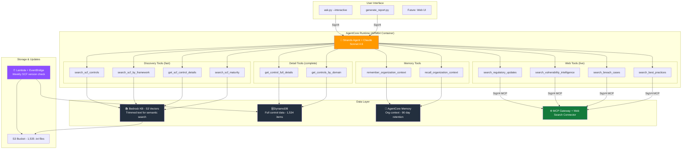
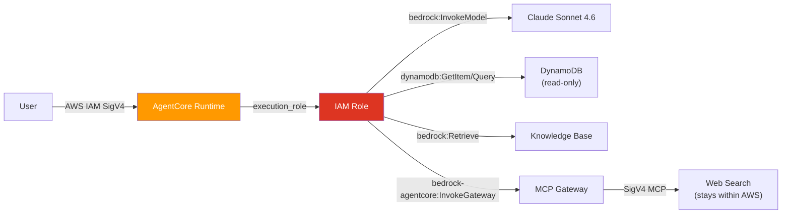

# Architecture Guidelines

## System Overview



## Data Flow Patterns

### Pattern 1: Gap Analysis
```
User: "What are my HIPAA gaps?"
  1. recall_organization_context → gets user's implemented controls from memory
  2. search_scf_by_framework("HIPAA") → KB returns relevant control IDs
  3. get_control_full_details("RSK-01,BCD-01,IRO-04,...") → DynamoDB returns full data
  4. Model compares implemented vs required → generates gap report
```

### Pattern 2: Control Detail Lookup
```
User: "Tell me about GOV-01"
  1. get_control_full_details("GOV-01") → DynamoDB returns everything
  2. Model formats the response
```

### Pattern 3: First Conversation (New User)
```
User: "We're a 175-person healthcare company..."
  1. recall_organization_context → empty (new user)
  2. Model asks clarifying questions
  3. remember_organization_context("org_profile", "175 employees, healthcare SaaS...")
  4. remember_organization_context("implemented_controls", "GOV-01, IAC-01, ...")
  5. Future sessions auto-load this context
```

### Pattern 4: Maturity Assessment
```
User: "Assess our IAC domain maturity"
  1. recall_organization_context → gets current capabilities
  2. get_controls_by_domain("IAC") → DynamoDB returns all IAC controls
  3. Model compares user's state against CMM criteria → scores each control
```

### Pattern 5: Web Research (Live Internet)
```
User: "Any new HIPAA enforcement actions this year?"
  1. search_regulatory_updates("HIPAA", "enforcement action")
     → SigV4-signed MCP tools/call to AgentCore Gateway
     → Gateway routes to Web Search connector
     → Returns live web results with titles, URLs, dates
  2. Model synthesizes results into a summary with source citations
```

### Pattern 6: Questionnaire Answer Lookup
```
User: "How do we answer the SIG question about encryption at rest?"
  1. search_approved_answers("encryption at rest", framework="SIG")
     → DynamoDB query on approved answers table
     → Returns matching historical responses with source citations
  2. If match found: present the approved answer with metadata
  3. If no match: search SCF controls for CRY-05, draft a new answer
```

### Pattern 7: Questionnaire Ingestion
```
Admin runs: python ingest_answers.py --file sig_2025.xlsx --framework SIG
  1. Parser reads XLSX (or CSV/JSON)
  2. Extracts Q&A pairs with category metadata
  3. Writes to DynamoDB as approved answers
  4. DynamoDB Stream triggers audit logger
  5. Audit log records: INSERT, who, when, full content
  6. Future: Textract OCR for scanned PDFs
```

### Pattern 8: Answer Audit Trail
```
Admin updates an answer's text or status
  1. DynamoDB Stream captures MODIFY event (old + new image)
  2. Audit Logger Lambda fires
  3. Writes audit record: answer_id, timestamp, who, old_value, new_value, fields_changed
  4. Queryable by answer_id + timestamp via GSI
  5. 365-day retention for compliance evidence
```

## Design Principles

### 1. Retrieval First, Never Batch Load
- **Do**: Vector search for discovery, point lookups for detail
- **Don't**: Load full datasets into memory, iterate in Python

### 2. Two-Step Data Access
- **Discovery** (KB): "Find me controls related to X" → fast, approximate
- **Detail** (DynamoDB): "Get me the full data for control X" → exact, complete

### 3. Tools Get Data, Model Reasons
- Tools should ONLY fetch data and return it
- The model handles all analysis, comparison, and recommendation logic
- Never write Python code to do what the model does natively

### 4. Memory for User Context, Not SCF Data
- Memory stores organizational info that changes (controls implemented, targets)
- SCF reference data lives in DynamoDB (static, updated by the auto-updater)

### 5. Keep Responses Under 4000 Tokens
- Complex analyses get delivered progressively (2-3 items per response)
- User asks for more detail on specific items
- Never attempt a 10-page report in a single response

## Infrastructure Components

| Component | Purpose | Size Limit | Cost Model |
|-----------|---------|------------|------------|
| AgentCore Runtime | Hosts agent container (ARM64) | No response size limit but ~60s timeout | Per-session |
| Bedrock KB (S3 Vectors) | Semantic search over controls | 2048 bytes metadata/record | Per-query |
| DynamoDB | Full control data storage | 400KB/item (plenty) | Per-request (pay-per-use) |
| AgentCore Memory | Cross-session org context | 90-day retention | Per-operation |
| S3 Bucket | Source text files for KB | No limit | Storage + requests |
| ECR | Agent container images | No limit | Storage |
| Web Search Gateway | Live internet access | 200 char query | Per-search |

## Security Model



- All access is IAM-authenticated (no API keys, no OAuth)
- Agent runtime role has least-privilege per-resource policies
- DynamoDB is read-only from the agent (no writes)
- Memory is scoped to the agent's memory ID
- Web search goes through SigV4-signed MCP calls to the gateway
- Web search queries stay within AWS infrastructure (never leave to third-party)

## Known Limitations

| Limitation | Cause | Workaround |
|-----------|-------|------------|
| KB has only ~7 controls indexed | S3 Vectors 2048-byte metadata limit | DynamoDB has full data; KB provides semantic hints, DynamoDB provides details |
| Long responses can timeout | AgentCore ~60s response buffer | System prompt limits to 4000 tokens; progressive delivery in conversation |
| ARM64 container builds are slow | QEMU emulation on x86 | Use pre-downloaded wheels; future: CI/CD on native ARM64 |
| AgentCore Gateway target provider bug | AWS provider 6.56 issue | `terraform apply -refresh-only` after first apply |
| Model must use inference profile ID | Bedrock on-demand requirement | Use `us.anthropic.*` not `anthropic.*`; run preflight.py to validate |
| Web Search connector requires console setup | CLI doesn't support connector targets | Add via AWS Console → Gateway → Add Target → Web Search |
| Web search returns errors if gateway not configured | Connector not added | Falls back gracefully with reference URLs to authoritative sources |

## Adding New Capabilities

### To add a new data source:
1. Create the AWS resource (Terraform)
2. Add IAM permission to the runtime role
3. Add environment variable to the runtime
4. Write a tool in `agent/tools/` that calls the resource
5. Import and register in `main.py`
6. Update system prompt to explain when to use it

### To change the model:
1. Update `terraform.tfvars` → `bedrock_model_id`
2. Run `python scripts/preflight.py` to verify it works
3. `terraform apply` to update the runtime env var
4. Rebuild container (only if model ID is hardcoded anywhere)

### To update SCF data:
1. Auto-updater checks weekly (or run `python scripts/reindex_kb.py` manually)
2. `python scripts/load_dynamodb.py` reloads DynamoDB
3. KB re-ingestion triggers automatically
