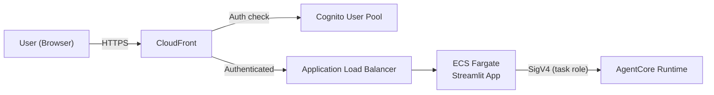

# Frontend Deployment Guide

## Local Development

```powershell
cd frontend
pip install -r requirements.txt
streamlit run app.py
```

Opens at `http://localhost:8501`. Uses your local AWS credentials automatically.

## Production Deployment on AWS (Cognito + CloudFront + ECS)

This guide deploys the Streamlit frontend as a secure web application with:
- **Cognito** for user authentication (email/password or SSO)
- **CloudFront** for HTTPS and CDN
- **ECS Fargate** for hosting the Streamlit app
- **ALB** for load balancing behind CloudFront

### Architecture



### Step 1: Create Cognito User Pool

```hcl
resource "aws_cognito_user_pool" "scf_agent" {
  name = "scf-agent-users"

  password_policy {
    minimum_length    = 12
    require_uppercase = true
    require_lowercase = true
    require_numbers   = true
    require_symbols   = true
  }

  mfa_configuration = "OPTIONAL"

  software_token_mfa_configuration {
    enabled = true
  }

  account_recovery_setting {
    recovery_mechanism {
      name     = "verified_email"
      priority = 1
    }
  }

  auto_verified_attributes = ["email"]
}

resource "aws_cognito_user_pool_client" "scf_agent" {
  name         = "scf-agent-web"
  user_pool_id = aws_cognito_user_pool.scf_agent.id

  generate_secret                      = false
  allowed_oauth_flows_user_pool_client = true
  allowed_oauth_flows                  = ["code"]
  allowed_oauth_scopes                 = ["email", "openid", "profile"]
  callback_urls                        = ["https://your-domain.com/callback"]
  logout_urls                          = ["https://your-domain.com/logout"]
  supported_identity_providers         = ["COGNITO"]
}

resource "aws_cognito_user_pool_domain" "scf_agent" {
  domain       = "scf-agent-auth"
  user_pool_id = aws_cognito_user_pool.scf_agent.id
}
```

### Step 2: Containerize the Frontend

```dockerfile
FROM python:3.13-slim

WORKDIR /app
COPY requirements.txt .
RUN pip install --no-cache-dir -r requirements.txt

COPY app.py .

EXPOSE 8501

HEALTHCHECK CMD curl --fail http://localhost:8501/_stcore/health || exit 1

ENTRYPOINT ["streamlit", "run", "app.py", "--server.port=8501", "--server.address=0.0.0.0", "--server.headless=true"]
```

### Step 3: Deploy to ECS Fargate

```hcl
resource "aws_ecs_cluster" "scf_frontend" {
  name = "scf-agent-frontend"
}

resource "aws_ecs_task_definition" "frontend" {
  family                   = "scf-agent-frontend"
  requires_compatibilities = ["FARGATE"]
  network_mode             = "awsvpc"
  cpu                      = 512
  memory                   = 1024
  execution_role_arn       = aws_iam_role.ecs_execution.arn
  task_role_arn            = aws_iam_role.ecs_task.arn

  container_definitions = jsonencode([{
    name      = "streamlit"
    image     = "${aws_ecr_repository.frontend.repository_url}:latest"
    essential = true
    portMappings = [{
      containerPort = 8501
      protocol      = "tcp"
    }]
    environment = [
      { name = "SCF_AGENT_ARN", value = aws_bedrockagentcore_agent_runtime.compliance_agent.agent_runtime_arn },
      { name = "AWS_REGION", value = "us-east-1" },
    ]
    logConfiguration = {
      logDriver = "awslogs"
      options = {
        "awslogs-group"         = "/ecs/scf-agent-frontend"
        "awslogs-region"        = "us-east-1"
        "awslogs-stream-prefix" = "streamlit"
      }
    }
  }])
}

# Task role needs permission to invoke the agent
resource "aws_iam_role" "ecs_task" {
  name = "scf-agent-frontend-task"
  assume_role_policy = jsonencode({
    Version = "2012-10-17"
    Statement = [{
      Effect    = "Allow"
      Action    = "sts:AssumeRole"
      Principal = { Service = "ecs-tasks.amazonaws.com" }
    }]
  })
}

resource "aws_iam_role_policy" "ecs_task_agent" {
  name = "invoke-agent"
  role = aws_iam_role.ecs_task.id
  policy = jsonencode({
    Version = "2012-10-17"
    Statement = [{
      Effect   = "Allow"
      Action   = ["bedrock-agentcore:InvokeAgentRuntime"]
      Resource = [aws_bedrockagentcore_agent_runtime.compliance_agent.agent_runtime_arn]
    }]
  })
}
```

### Step 4: ALB + CloudFront with Cognito Auth

```hcl
resource "aws_lb" "frontend" {
  name               = "scf-agent-frontend-alb"
  internal           = true
  load_balancer_type = "application"
  subnets            = var.private_subnet_ids
  security_groups    = [aws_security_group.alb.id]
}

resource "aws_lb_target_group" "frontend" {
  name        = "scf-frontend-tg"
  port        = 8501
  protocol    = "HTTP"
  vpc_id      = var.vpc_id
  target_type = "ip"

  health_check {
    path = "/_stcore/health"
  }
}

resource "aws_cloudfront_distribution" "frontend" {
  enabled = true

  origin {
    domain_name = aws_lb.frontend.dns_name
    origin_id   = "alb"

    custom_origin_config {
      http_port              = 80
      https_port             = 443
      origin_protocol_policy = "http-only"
      origin_ssl_protocols   = ["TLSv1.2"]
    }
  }

  default_cache_behavior {
    allowed_methods        = ["GET", "HEAD", "OPTIONS", "PUT", "POST", "PATCH", "DELETE"]
    cached_methods         = ["GET", "HEAD"]
    target_origin_id       = "alb"
    viewer_protocol_policy = "redirect-to-https"

    forwarded_values {
      query_string = true
      headers      = ["*"]
      cookies { forward = "all" }
    }
  }

  restrictions {
    geo_restriction { restriction_type = "none" }
  }

  viewer_certificate {
    cloudfront_default_certificate = true
    # For custom domain: use ACM certificate
    # acm_certificate_arn = aws_acm_certificate.frontend.arn
    # ssl_support_method  = "sni-only"
  }
}
```

### Step 5: Protect with Cognito (Lambda@Edge)

Add a Lambda@Edge function to CloudFront that validates Cognito JWT tokens:

```python
# lambda_edge/auth.py
import json
import urllib.request
import jose.jwt

COGNITO_REGION = "us-east-1"
USER_POOL_ID = "us-east-1_XXXXXXX"
CLIENT_ID = "your-client-id"
JWKS_URL = f"https://cognito-idp.{COGNITO_REGION}.amazonaws.com/{USER_POOL_ID}/.well-known/jwks.json"

def handler(event, context):
    request = event["Records"][0]["cf"]["request"]
    headers = request["headers"]

    # Check for auth cookie or redirect to Cognito login
    # ... (full implementation depends on your auth flow)
    
    return request
```

Alternatively, use **AWS WAF + Cognito** on the ALB directly (simpler):

```hcl
resource "aws_lb_listener_rule" "cognito_auth" {
  listener_arn = aws_lb_listener.frontend.arn

  action {
    type = "authenticate-cognito"
    authenticate_cognito {
      user_pool_arn       = aws_cognito_user_pool.scf_agent.arn
      user_pool_client_id = aws_cognito_user_pool_client.scf_agent.id
      user_pool_domain    = aws_cognito_user_pool_domain.scf_agent.domain
    }
  }

  action {
    type             = "forward"
    target_group_arn = aws_lb_target_group.frontend.arn
  }

  condition {
    path_pattern { values = ["/*"] }
  }
}
```

### Security Checklist

- [ ] Cognito user pool with strong password policy + MFA
- [ ] HTTPS everywhere (CloudFront → ALB can be HTTP if internal)
- [ ] ECS task role scoped to only `InvokeAgentRuntime` on the specific agent ARN
- [ ] ALB in private subnets (not internet-facing)
- [ ] CloudFront with WAF rate limiting
- [ ] Cognito token validation on every request
- [ ] Session timeout (Streamlit + Cognito token expiry)
- [ ] Audit trail via CloudTrail + ALB access logs

### Cost Estimate (Production)

| Component | Monthly Cost |
|-----------|-------------|
| ECS Fargate (0.5 vCPU, 1GB) | ~$15 |
| ALB | ~$16 + data |
| CloudFront | ~$1-5 (depending on traffic) |
| Cognito | Free tier (50K MAU) |
| **Total** | **~$35/month** + agent invocation costs |
