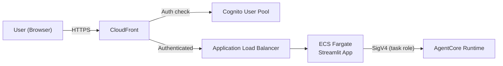

# Frontend Deployment Guide

## Authentication overview

The frontend is protected at two layers, and you can use either or both:

1. **Application-level login (built in).** `app.py` and the approval page call
   `require_login()` from `auth.py`, which uses Streamlit's native OIDC
   (`st.login` / `st.user`). Pages render nothing until the user signs in, and
   the app fails closed if login isn't configured. This works for local
   development and any hosting model. Configure it via
   `.streamlit/secrets.toml` (see below).
2. **Infrastructure-level auth (production).** When deploying on AWS, an
   ALB `authenticate-cognito` action (or Lambda@Edge) fronts the container so
   unauthenticated requests never reach Streamlit at all. See the production
   section below.

For a hardened deployment, use both: infrastructure auth as the outer gate and
the built-in login as defense in depth. At minimum, never run the frontend
without the application-level login enabled — the approval queue controls what
answers the agent trusts.

## Local Development

```powershell
cd frontend
pip install -r requirements.txt

# One-time: configure OIDC login
cp .streamlit/secrets.toml.example .streamlit/secrets.toml
# Edit .streamlit/secrets.toml — fill in client_id, client_secret,
# server_metadata_url, redirect_uri, and a generated cookie_secret:
#   python -c "import secrets; print(secrets.token_urlsafe(48))"

streamlit run app.py
```

Opens at `http://localhost:8501`. Uses your local AWS credentials automatically
for agent invocation. You'll be prompted to sign in before any page loads.

### Configuring login with the existing Cognito pool

The project already defines a Cognito user pool in
[`terraform/cognito-a2a.tf`](../terraform/cognito-a2a.tf) (`enable_a2a = true`).
Its `a2a_web` client uses the authorization-code flow and is a good template.
For the Streamlit frontend, point `.streamlit/secrets.toml` at a web app client
that has:

- `allowed_oauth_flows = ["code"]`
- scopes including `openid` and `email`
- `http://localhost:8501/oauth2callback` in its `callback_urls` (add your
  production URL for deployed environments)

Then set `server_metadata_url` to:

```
https://cognito-idp.<region>.amazonaws.com/<user-pool-id>/.well-known/openid-configuration
```

`.streamlit/secrets.toml` holds the client secret and is git-ignored — commit
only `.streamlit/secrets.toml.example`.

## Deployed: ECS Fargate + ALB + CloudFront (this is what `terraform apply` provisions)

`terraform/frontend.tf` hosts the frontend on **ECS Fargate behind an ALB, with
CloudFront in front**:

```
Browser --HTTPS/WSS--> CloudFront (*.cloudfront.net) --HTTP--> ALB --> Fargate task (Streamlit :8501)
```

CloudFront supplies a free HTTPS `*.cloudfront.net` domain and, crucially,
forwards the WebSocket (`/_stcore/stream`) that Streamlit needs — **AWS App Runner
does not support WebSockets**, so it cannot host Streamlit. No ACM certificate or
custom domain is required. Direct ALB access is refused: CloudFront injects a
secret `X-Origin-Verify` header and the ALB listener returns 403 without it; the
ALB security group only accepts the CloudFront edge prefix list.

Auth is the application-level `st.login` gate (`frontend/auth.py`) backed by a
dedicated confidential Cognito app client (`aws_cognito_user_pool_client.frontend`)
on the same user pool as the A2A routes. `client_secret` and a generated
`cookie_secret` are SSM SecureString parameters, injected as ECS container
`secrets`; `frontend/entrypoint.sh` assembles `.streamlit/secrets.toml` from the
environment at container start. The ECS **task role** is scoped to exactly
`bedrock-agentcore:InvokeAgentRuntime` on the runtime and read/write on the
`approved-answers` DynamoDB table; the **execution role** only pulls the image and
the two SSM secrets.

The service runs in the **default VPC** public subnets with a public IP (to pull
the image and reach Bedrock without a NAT gateway).

### First deploy (bootstrap + two-phase)

The image must exist before the ECS service, and CloudFront's domain is only known
after creation but is needed in the Cognito callback + the container's
`AUTH_REDIRECT_URI` — so the first deploy is bootstrap + two applies:

```powershell
cd terraform
# terraform.tfvars: enable_frontend = true, enable_a2a = true, frontend_base_url = ""

# 1. Create just the ECR repo
terraform apply -target=aws_ecr_repository.frontend

# 2. Build + push the frontend image (linux/amd64)
cd ..\frontend
.\build-and-push.ps1 -Region us-east-1
cd ..\terraform

# 3. Phase 1 - create the ALB + Fargate service + CloudFront (login not yet functional).
#    CloudFront takes ~5-10 min to deploy.
terraform apply

# 4. Phase 2 - feed the real URL back in
terraform output -raw frontend_url          # -> https://dxxxxxxxxxxxxx.cloudfront.net
# set frontend_base_url in terraform.tfvars to that value (no trailing slash)
terraform apply                             # updates the Cognito callback + redeploys the task
```

After this, a new image goes live by pushing it and forcing a deployment:

```powershell
cd ..\frontend
.\build-and-push.ps1 -Region us-east-1
aws ecs update-service --cluster scf-agent-frontend --service scf-agent-frontend `
  --force-new-deployment --region us-east-1
```

Tear down with `enable_frontend = false` + `terraform apply`.

### Add a user

The pool is admin-create-only:

```powershell
aws cognito-idp admin-create-user `
  --user-pool-id (terraform output -raw cognito_user_pool_id) `
  --username you@example.com `
  --user-attributes Name=email,Value=you@example.com Name=email_verified,Value=true `
  --desired-delivery-mediums EMAIL `
  --region us-east-1
# The temporary password is *meant* to arrive by email, but this pool has no SES
# email_configuration - it uses Cognito's shared COGNITO_DEFAULT sender, which is
# unreliable and gives no delivery visibility. If it doesn't arrive, skip email
# entirely and set a permanent password directly (no invite needed):
aws cognito-idp admin-set-user-password `
  --user-pool-id (terraform output -raw cognito_user_pool_id) `
  --username you@example.com `
  --password 'Some-Strong-Passw0rd!' `
  --permanent `
  --region us-east-1
```

For a real deployment with many users, wire `email_configuration` on
`aws_cognito_user_pool.a2a` (`terraform/cognito-a2a.tf`) to Amazon SES instead — that
needs a verified sending domain/address in SES and gives reliable delivery plus bounce
visibility. Not set up here; `admin-set-user-password` is the supported path for now.

### Cost

Roughly **$25-35/month**: ALB ~$16 + Fargate 0.5 vCPU / 1 GB always-on ~$9 +
CloudFront (pennies at low traffic). `enable_frontend = false` removes all of it.

### Troubleshooting

| Symptom | Cause / fix |
|---------|-------------|
| Page shows only the Streamlit loading skeleton; console: `wss://.../_stcore/stream failed` | The WebSocket isn't reaching the task. Check the ALB target group is healthy and that CloudFront's origin request policy is `Managed-AllViewer` (forwards the `Upgrade`/`Connection` headers). |
| `403` "Direct access is not allowed" | You hit the ALB directly. Use the CloudFront URL (`terraform output -raw frontend_url`). |
| ECS task keeps restarting, no app logs | Usually `entrypoint.sh` with CRLF line endings — the Dockerfile normalises with `sed` and runs `bash /app/entrypoint.sh`; rebuild + push + `--force-new-deployment`. Otherwise check `/ecs/scf-agent-frontend` logs. |
| Login loops back to the sign-in screen | `frontend_base_url` doesn't match the real CloudFront URL, so the Cognito callback / `AUTH_REDIRECT_URI` are wrong. Set it to `terraform output -raw frontend_url` and re-apply (phase 2). |
| `⚠️ Error invoking agent` in chat | Task role or agent runtime issue — check `/ecs/scf-agent-frontend` logs. |

## Alternative: custom domain instead of CloudFront's

If you own a domain and have an ACM certificate in the ALB's region, you can drop
CloudFront and put an HTTPS (443) listener with the cert directly on the ALB, then
point a Route 53 alias at it. The rest of the stack (Fargate, task/exec roles,
Cognito client, SSM secrets) is unchanged; set `frontend_base_url` to
`https://<your-domain>`. The section below is a fuller build-out of that pattern
with Cognito at the ALB as an outer gate:
- **Cognito** for user authentication (email/password or SSO)
- **CloudFront** for HTTPS and CDN
- **ECS Fargate** for hosting the Streamlit app
- **ALB** for load balancing behind CloudFront

### Architecture



### Step 1: Create Cognito User Pool

```hcl
resource "aws_cognito_user_pool" "scf_agent" {
  name = "scf-agent-users"

  password_policy {
    minimum_length    = 12
    require_uppercase = true
    require_lowercase = true
    require_numbers   = true
    require_symbols   = true
  }

  mfa_configuration = "OPTIONAL"

  software_token_mfa_configuration {
    enabled = true
  }

  account_recovery_setting {
    recovery_mechanism {
      name     = "verified_email"
      priority = 1
    }
  }

  auto_verified_attributes = ["email"]
}

resource "aws_cognito_user_pool_client" "scf_agent" {
  name         = "scf-agent-web"
  user_pool_id = aws_cognito_user_pool.scf_agent.id

  generate_secret                      = false
  allowed_oauth_flows_user_pool_client = true
  allowed_oauth_flows                  = ["code"]
  allowed_oauth_scopes                 = ["email", "openid", "profile"]
  callback_urls                        = ["https://your-domain.com/callback"]
  logout_urls                          = ["https://your-domain.com/logout"]
  supported_identity_providers         = ["COGNITO"]
}

resource "aws_cognito_user_pool_domain" "scf_agent" {
  domain       = "scf-agent-auth"
  user_pool_id = aws_cognito_user_pool.scf_agent.id
}
```

### Step 2: Containerize the Frontend

```dockerfile
FROM python:3.13-slim

WORKDIR /app
COPY requirements.txt .
RUN pip install --no-cache-dir -r requirements.txt

# Copy the app, shared auth helper, sub-pages, and Streamlit config.
# Do NOT bake secrets.toml into the image — inject it at runtime
# (mounted volume or secrets manager) so the client secret stays out of the image.
COPY app.py auth.py ./
COPY pages/ ./pages/
COPY .streamlit/config.toml ./.streamlit/config.toml

EXPOSE 8501

HEALTHCHECK CMD curl --fail http://localhost:8501/_stcore/health || exit 1

ENTRYPOINT ["streamlit", "run", "app.py", "--server.port=8501", "--server.address=0.0.0.0", "--server.headless=true"]
```

### Step 3: Deploy to ECS Fargate

```hcl
resource "aws_ecs_cluster" "scf_frontend" {
  name = "scf-agent-frontend"
}

resource "aws_ecs_task_definition" "frontend" {
  family                   = "scf-agent-frontend"
  requires_compatibilities = ["FARGATE"]
  network_mode             = "awsvpc"
  cpu                      = 512
  memory                   = 1024
  execution_role_arn       = aws_iam_role.ecs_execution.arn
  task_role_arn            = aws_iam_role.ecs_task.arn

  container_definitions = jsonencode([{
    name      = "streamlit"
    image     = "${aws_ecr_repository.frontend.repository_url}:latest"
    essential = true
    portMappings = [{
      containerPort = 8501
      protocol      = "tcp"
    }]
    environment = [
      { name = "SCF_AGENT_ARN", value = aws_bedrockagentcore_agent_runtime.compliance_agent.agent_runtime_arn },
      { name = "AWS_REGION", value = "us-east-1" },
    ]
    logConfiguration = {
      logDriver = "awslogs"
      options = {
        "awslogs-group"         = "/ecs/scf-agent-frontend"
        "awslogs-region"        = "us-east-1"
        "awslogs-stream-prefix" = "streamlit"
      }
    }
  }])
}

# Task role needs permission to invoke the agent
resource "aws_iam_role" "ecs_task" {
  name = "scf-agent-frontend-task"
  assume_role_policy = jsonencode({
    Version = "2012-10-17"
    Statement = [{
      Effect    = "Allow"
      Action    = "sts:AssumeRole"
      Principal = { Service = "ecs-tasks.amazonaws.com" }
    }]
  })
}

resource "aws_iam_role_policy" "ecs_task_agent" {
  name = "invoke-agent"
  role = aws_iam_role.ecs_task.id
  policy = jsonencode({
    Version = "2012-10-17"
    Statement = [{
      Effect   = "Allow"
      Action   = ["bedrock-agentcore:InvokeAgentRuntime"]
      Resource = [aws_bedrockagentcore_agent_runtime.compliance_agent.agent_runtime_arn]
    }]
  })
}
```

### Step 4: ALB + CloudFront with Cognito Auth

```hcl
resource "aws_lb" "frontend" {
  name               = "scf-agent-frontend-alb"
  internal           = true
  load_balancer_type = "application"
  subnets            = var.private_subnet_ids
  security_groups    = [aws_security_group.alb.id]
}

resource "aws_lb_target_group" "frontend" {
  name        = "scf-frontend-tg"
  port        = 8501
  protocol    = "HTTP"
  vpc_id      = var.vpc_id
  target_type = "ip"

  health_check {
    path = "/_stcore/health"
  }
}

resource "aws_cloudfront_distribution" "frontend" {
  enabled = true

  origin {
    domain_name = aws_lb.frontend.dns_name
    origin_id   = "alb"

    custom_origin_config {
      http_port              = 80
      https_port             = 443
      origin_protocol_policy = "http-only"
      origin_ssl_protocols   = ["TLSv1.2"]
    }
  }

  default_cache_behavior {
    allowed_methods        = ["GET", "HEAD", "OPTIONS", "PUT", "POST", "PATCH", "DELETE"]
    cached_methods         = ["GET", "HEAD"]
    target_origin_id       = "alb"
    viewer_protocol_policy = "redirect-to-https"

    forwarded_values {
      query_string = true
      headers      = ["*"]
      cookies { forward = "all" }
    }
  }

  restrictions {
    geo_restriction { restriction_type = "none" }
  }

  viewer_certificate {
    cloudfront_default_certificate = true
    # For custom domain: use ACM certificate
    # acm_certificate_arn = aws_acm_certificate.frontend.arn
    # ssl_support_method  = "sni-only"
  }
}
```

### Step 5: Protect with Cognito (Lambda@Edge)

Add a Lambda@Edge function to CloudFront that validates Cognito JWT tokens:

```python
# lambda_edge/auth.py
import json
import urllib.request
import jose.jwt

COGNITO_REGION = "us-east-1"
USER_POOL_ID = "us-east-1_XXXXXXX"
CLIENT_ID = "your-client-id"
JWKS_URL = f"https://cognito-idp.{COGNITO_REGION}.amazonaws.com/{USER_POOL_ID}/.well-known/jwks.json"

def handler(event, context):
    request = event["Records"][0]["cf"]["request"]
    headers = request["headers"]

    # Check for auth cookie or redirect to Cognito login
    # ... (full implementation depends on your auth flow)
    
    return request
```

Alternatively, use **AWS WAF + Cognito** on the ALB directly (simpler):

```hcl
resource "aws_lb_listener_rule" "cognito_auth" {
  listener_arn = aws_lb_listener.frontend.arn

  action {
    type = "authenticate-cognito"
    authenticate_cognito {
      user_pool_arn       = aws_cognito_user_pool.scf_agent.arn
      user_pool_client_id = aws_cognito_user_pool_client.scf_agent.id
      user_pool_domain    = aws_cognito_user_pool_domain.scf_agent.domain
    }
  }

  action {
    type             = "forward"
    target_group_arn = aws_lb_target_group.frontend.arn
  }

  condition {
    path_pattern { values = ["/*"] }
  }
}
```

### Security Checklist

- [ ] Application-level login enabled (`.streamlit/secrets.toml` present; app fails closed without it)
- [ ] `secrets.toml` injected at runtime, not baked into the container image
- [ ] Approvals attributed to the verified signed-in identity (no free-text names)
- [ ] Cognito user pool with strong password policy + MFA
- [ ] HTTPS everywhere (CloudFront → ALB can be HTTP if internal)
- [ ] ECS task role scoped to only `InvokeAgentRuntime` on the specific agent ARN
- [ ] ALB in private subnets (not internet-facing)
- [ ] CloudFront with WAF rate limiting
- [ ] Cognito token validation on every request
- [ ] Session timeout (Streamlit + Cognito token expiry)
- [ ] Audit trail via CloudTrail + ALB access logs

### Cost Estimate (Production)

| Component | Monthly Cost |
|-----------|-------------|
| ECS Fargate (0.5 vCPU, 1GB) | ~$15 |
| ALB | ~$16 + data |
| CloudFront | ~$1-5 (depending on traffic) |
| Cognito | Free tier (50K MAU) |
| **Total** | **~$35/month** + agent invocation costs |
